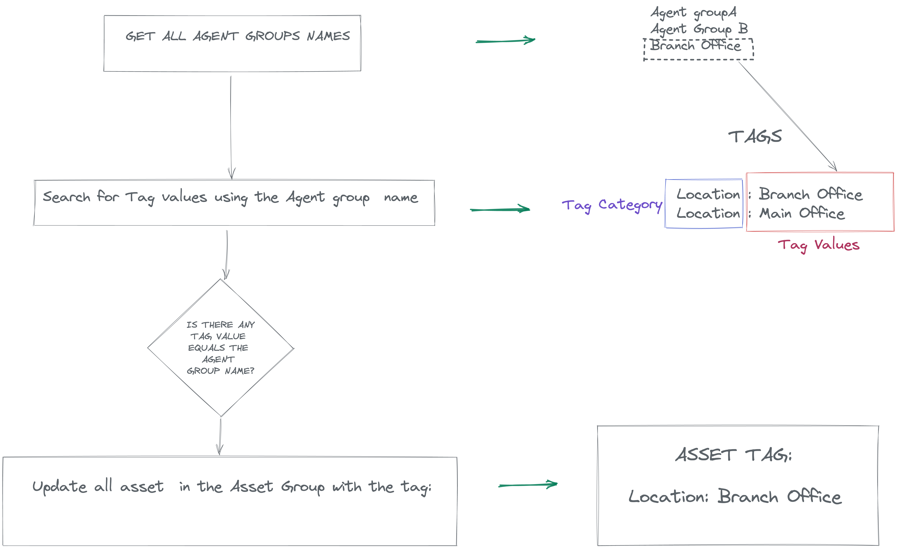

# TenableTagAgentGroups

An alternative to implement automatic agent tagging  based on agent groups in tenable.io

## Flow



## Requirements


- The Tag Category + Value should be created previously
- The asset group name should match the tag value
- Right permissions to edit the Tag Value


## Installation

`pip install -r requirements.txt`

## Usage

```
export TENABLE_ACCESS_KEY=YOUR API KEY>
export TENABLE_SECRET_KEY=YOUR_SECRET_KEY

python3 run.py
```

Or just create the ".env" file with the following variables:


```
TENABLE_ACCESS_KEY=YOU_API_KEY
TENABLE_SECRET_KEY=YOUR_SECRET_KEY

python3 run.py
```

### Docker

#### Build the image

```
Docker build -t tag-tenable-agent-groups .
```
#### Run

```
docker run -it --rm -e TENABLE_ACCESS_KEY=YOU_API_KEY -e TENABLE_SECRET_KEY=YOUR_SECRET_KEY tag-tenable-agent-groups
```
